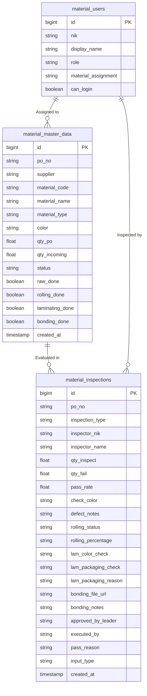
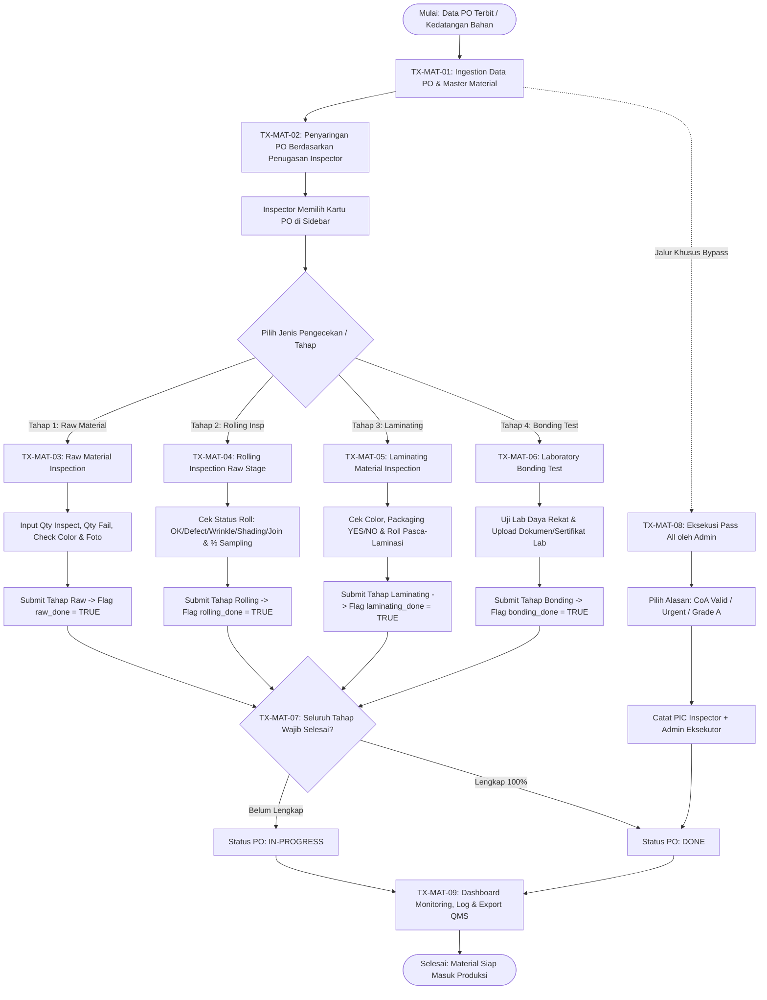
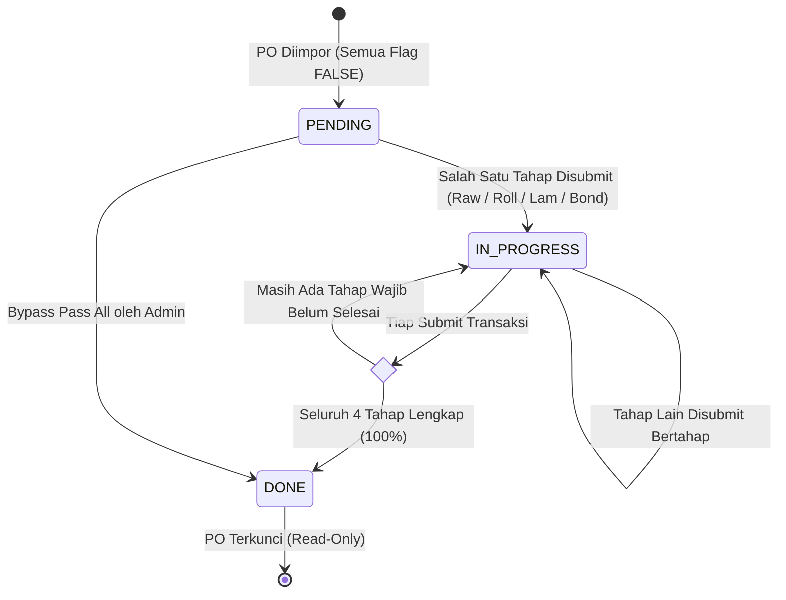

# END-TO-END BUSINESS PROCESS: IQC MATERIAL (RAW MATERIAL QUALITY CONTROL)
**Document Version:** 2.0  
**Target Platform:** eQMS Incoming Quality Control (Raw Material Division)  
**Output Purpose:** Blueprint Operasional & Struktur Prompt Presentasi (Slide-by-Slide PPT Generation)

---

## SLIDE 1: Executive Summary & Konteks Bisnis IQC Material
### 1. Definisi & Ruang Lingkup
- **IQC Material (Incoming Quality Control Material):** Sistem manajemen mutu bahan baku untuk menguji, memverifikasi, dan melacak kepatuhan teknis seluruh pasokan material mentah (*Raw Material Inbound*) sebelum diproses ke lini pemotongan (*Cutting*), penyesuaian (*Laminating*), dan perakitan (*Assembly*).
- **Cakupan Kategori Bahan:**
  1. *Textile / Fabric* (Kain mesh, canvas, lining, webbing).
  2. *Synthetic Leather* (PU, PVC, microfiber).
  3. *Genuine Leather* (Kulit asli suede, full grain, nubuck).
  4. *Accessories & Trims* (Tali sepatu, eyelet, buckle, zipper, label).
  5. *Chemicals & Adhesives* (Lem, primer, hardener, cat).
- **Objektif Bisnis:**
  - Standardisasi **4 Tahap Inspeksi Khusus** (*Multi-Stage Quality Gates*).
  - Penugasan inspeksi presisi berbasis kompetensi material (*Material-Based Assignment*).
  - Akuntabilitas ganda fitur bypass produksi (*Dual-Actor Traceability pada Pass All*).
  - Kesiapan audit ISO 9001 / IATF 16949 tanpa celah data (*zero unverified material*).

---

## SLIDE 2: Matriks Aktor, Peran & Tanggung Jawab (RACI Matrix)
| Peran / Aktor | Tanggung Jawab Utama | Akses Sistem |
| :--- | :--- | :--- |
| **Receiving / Raw Inspector** | Verifikasi fisik lot kedatangan, uji sampling visual, hitung Pass/Fail Rate, cek kesesuaian warna (*Color Check*). | Form Inspeksi (Tab Raw Material). |
| **Rolling Inspector** | Pemeriksaan kualitas gulungan roll material mentah (*pre-process roll*), identifikasi cacat fisik roll (*wrinkle, shading, join*). | Form Inspeksi (Tab Rolling Inspection). |
| **Laminating Inspector** | Pemeriksaan hasil proses laminasi, verifikasi warna pasca-laminasi, audit kualitas kemasan (*Packaging Check*), audit roll laminasi. | Form Inspeksi (Tab Laminating). |
| **Lab / Bonding Technician** | Pengujian daya rekat laboratorium (*Bonding Strength Test*), pencatatan parameter lab, upload laporan uji (*Evidence PDF/Excel*). | Form Inspeksi (Tab Bonding Test). |
| **QC Leader** | Evaluasi teknis lot bermasalah (*Qty Fail > 0*), validasi hasil uji marginal, eksekusi persetujuan bersyarat (*Approved by Leader*). | Form Inspeksi, Inspection Log. |
| **QC System Admin** | Upload & sinkronisasi data PO/Master, penugasan wewenang kategori material (*User Assignment*), eksekusi fitur *Pass All* dengan alasan terdokumentasi. | Admin Panel (Manage PO, Users, Pass All). |

---

## SLIDE 3: Arsitektur Data & Entitas Transaksi
### Struktur Data Relasional IQC Material

---

## SLIDE 4: Diagram Alur Proses Bisnis End-to-End (Global Flowchart)

---

## SLIDE 5: Transaksi 1 — Ingestion & Sinkronisasi PO Master (TX-MAT-01)
### 1. Deskripsi Transaksi
Proses penerimaan dan validasi data Purchase Order (*PO*) bahan baku dari sistem ERP/Purchasing ke dalam tabel operasional `material_master_data`.
### 2. Sumber & Alur Data
- **Metode Integrasi:** Upload berkas harian (Excel/CSV) atau sinkronisasi API terjadwal.
- **Atribut Wajib PO:**
  - Nomor PO (*po_no*) & Nama Pemasok (*supplier*).
  - Kode Material (*material_code*) & Deskripsi Bahan (*material_name*).
  - Kategori Bahan (*material_type*): `TEXTILE`, `SYNTHETIC`, `LEATHER`, `ACCESSORIES & CHEMICAL`.
  - Warna (*color*), Jumlah Pesanan (*qty_po*), dan Jumlah Datang (*qty_incoming*).
### 3. Inisialisasi Status & Flags
- Setiap PO baru otomatis berstatus `pending`.
- Empat status flag diinisialisasi nilai `FALSE`:
  - `raw_done = false`
  - `rolling_done = false`
  - `laminating_done = false`
  - `bonding_done = false`

---

## SLIDE 6: Transaksi 2 — Penyaringan PO Berbasis Penugasan Inspector (TX-MAT-02)
### 1. Kebutuhan Bisnis
Dalam skala industri, inspeksi kulit sintetis membutuhkan keahlian berbeda dengan inspeksi kain rajut atau bahan kimia. Diperlukan isolasi tugas (*task specialization*) agar inspector hanya fokus pada material sesuai kompetensinya.
### 2. Mekanisme Multi-Inspector Assignment
- Di Admin Panel, pengguna diberi penugasan (*material_assignment*) berupa:
  - **Kategori Bahan:** Misal `TEXTILE, SYNTHETIC` atau `LEATHER`.
  - **Kode Material Spesifik:** Misal `RM.SYN.008020007L.10A`.
  - **Tahap Inspeksi:** Misal `Raw Material, Rolling Inspection`.
- Saat pengguna login ke Form Inspeksi (`material/index.html`):
  - Sistem mencocokkan `currentUser.material_assignment` terhadap `po.material_type` dan `po.material_name`.
  - Sidebar daftar PO hanya memunculkan material yang menjadi wewenang pengguna aktif.
- **Dukungan Tim Paralel:** Dua atau lebih inspector (misal: Fajar & Ahmad) dapat memiliki assignment yang sama untuk menangani beban volume tinggi bersama-sama.

---

## SLIDE 7: Transaksi 3 — Tahap 1: Raw Material Physical Inspection (TX-MAT-03)
### 1. Deskripsi Tahap
Verifikasi awal saat material tiba di dermaga bongkar (*inbound receiving*).
### 2. Parameter Input & Aturan Bisnis
- **Qty Inspect & Qty Fail:**
  - Input jumlah sampel periksa dan jumlah cacat.
  - Sistem otomatis menghitung *Pass Rate (%)* dan *Fail Rate (%)*.
  - Rumus: `Pass Rate = ((Qty Inspect - Qty Fail) / Qty Inspect) * 100`.
- **Check Color:** Pemeriksaan visual kesesuaian warna bahan mentah terhadap standar warna acuan (*Swatch/Pantone*). Nilai default: `OK`.
- **Defect Notes:** Deskripsi cacat spesifik (misal: *noda oli, lubang tenun, scratch*).
- **Approved by Leader:** Wajib dipilih jika ditemukan cacat (*Qty Fail > 0*) untuk otorisasi toleransi teknis.
- **Evidence Upload:** Lampiran foto fisik kerusakan bahan untuk klaim ke vendor.
### 3. Output Transaksi
- Baris tercatat di `material_inspections` dengan `inspection_type = 'Raw Material'`.
- Flag `raw_done = TRUE` pada PO terkait di `material_master_data`.

---

## SLIDE 8: Transaksi 4 — Tahap 2: Rolling Inspection Raw Stage (TX-MAT-04)
### 1. Deskripsi Tahap
Pemeriksaan gulungan roll bahan mentah sebelum masuk proses pemotongan atau laminasi, khusus untuk material tekstil dan kulit sintetis.
### 2. Parameter Uji Rolling
- **Status Roll Visual (Katalog Defect Roll):**
  - `Roll OK`: Gulungan rata, bersih, dan bebas cacat.
  - `Roll DEFECT`: Terdapat robek, lubang, atau kontaminasi fisik.
  - `Roll WRINKLE`: Kerutan parah yang dapat merusak akurasi pemotongan pola.
  - `Roll SHADING`: Perbedaan gradasi warna antar ujung roll (*head-to-tail shading*).
  - `Roll JOIN`: Terlalu banyak sambungan dalam satu roll melebihi toleransi standar (maksimal 2 join).
- **Roll Sample Percentage (%):** Persentase roll yang dibuka dan diperiksa (standar: 10%, 20%, hingga 100% untuk vendor bermasalah).
- **Catatan Detail Roll:** Pencatatan nomor barcode roll, panjang aktual dalam meter/yard, dan koordinat cacat.
### 3. Output Transaksi
- Tercatat di `material_inspections` dengan `inspection_type = 'Rolling Inspection'`.
- Flag `rolling_done = TRUE` pada PO terkait.

---

## SLIDE 9: Transaksi 5 — Tahap 3: Laminating Material Inspection (TX-MAT-05)
### 1. Deskripsi Tahap
Inspeksi jaminan mutu setelah material digabungkan melalui proses laminasi (*adhesive heat/sponge lamination*).
### 2. Parameter Uji Komprehensif
1. **Color Check (Toggle YES / NO):**
   - Verifikasi apakah warna bahan mengalami degradasi/perubahan akibat panas laminasi.
   - Input hasil manual teks (contoh: *Color OK / Shade Delta < 0.5*).
2. **Packaging Check (Toggle YES / NO):**
   - Memeriksa keutuhan kemasan pembungkus plastik pelindung kelembapan (*polybag*).
   - **Aturan Wajib:** Jika auditor memilih **NO**, kolom *Alasan Packaging Reject* wajib diisi (misal: *plastik sobek, basah, label barcode hilang*).
3. **Post-Laminating Roll Inspection:**
   - Checkbox pengaktifan uji roll pasca-laminasi.
   - Input *Custom Percentage Roll (%)* yang diperiksa.
### 3. Output Transaksi
- Tercatat di `material_inspections` dengan `inspection_type = 'Laminating'`.
- Flag `laminating_done = TRUE` pada PO terkait.

---

## SLIDE 10: Transaksi 6 — Tahap 4: Laboratory Bonding Test (TX-MAT-06)
### 1. Deskripsi Tahap
Pengujian destruktif laboratorium untuk memastikan daya rekat antar lapisan material memenuhi standar kekuatan rekat industri sepatu (standar internasional: minimal 2.5–3.0 kgf/cm).
### 2. Parameter Pengujian Lab
- **Dokumen Bukti Pengujian (*Evidence Document*):**
  - Upload berkas resmi dari mesin *Tensile Test Lab* (format didukung: PDF, Excel XLSX/XLS, atau Gambar/Foto uji robek, kapasitas maks. 10MB).
  - Berkas diunggah otomatis ke cloud storage dengan nama unik berbasis tanggal dan nomor PO.
- **Catatan Hasil Uji (*Bonding Notes*):**
  - Rekam data nilai gaya rekat (*peel strength value*), tipe sobekan (*foam tear / delamination*), dan suhu oven aktivasi.
### 3. Output Transaksi
- Tercatat di `material_inspections` dengan `inspection_type = 'Bonding Test'`.
- Flag `bonding_done = TRUE` pada PO terkait.

---

## SLIDE 11: Transaksi 7 — Siklus Status PO & Validasi Kelulusan (TX-MAT-07)
### 1. Logika Lifecycle Status PO

### 2. Aturan Proteksi Data (*Anti-Tampering*)
- Jika suatu PO telah mencapai status `Done`, sistem menampilkan spanduk peringatan terkunci (*Done Notice Banner*).
- Form inspeksi terkunci (*read-only*) untuk mencegah manipulasi atau penimpaan data yang sudah tervalidasi.

---

## SLIDE 12: Transaksi 8 — Bypass Otorisasi Admin: Fitur "Pass All" (TX-MAT-08)
### 1. Kebutuhan Khusus Operasional
Dalam kondisi manufaktur mendesak (*urgent line stoppage*) atau kedatangan bahan bersertifikat dari vendor terakreditasi Grade A dengan sertifikat analisis (*CoA / Certificate of Analysis*) lengkap, Admin memiliki wewenang membypass inspeksi parsial.
### 2. Dual-Actor Traceability (Akuntabilitas Penuh)
Setiap eksekusi *Pass All* wajib mencatat:
- **`inspector_nik` & `inspector_name`:** PIC Inspector yang sah ditugaskan pada material tersebut.
- **`executed_by`:** Nama lengkap Admin yang menekan tombol eksekusi *Pass All*.
- **`pass_reason`:** Alasan resmi yang dipilih dari menu terstandarisasi:
  1. *Sertifikat CoA / Lab Test Vendor Valid*
  2. *Direct to Line (Urgent Production Feeding)*
  3. *Vendor Grade A (Certified Partner)*
  4. *Instruksi Khusus Leader / QC Manager*
  5. *Lainnya (Disertai Catatan Khusus)*
- **`input_type`:** Dilabeli sistem sebagai `'batch_pass_all'` (membedakannya dari inspeksi manual).
### 3. Dampak Teknis
- Eksekusi PostgreSQL RPC `fn_pass_all_materials`:
  - Mengubah keempat flag (`raw_done, rolling_done, laminating_done, bonding_done`) menjadi `TRUE`.
  - Mengubah status master PO langsung menjadi `done`.
  - Menghasilkan rekam jejak audit yang lolos 100% verifikasi audit internal & eksternal ISO/QMS.

---

## SLIDE 13: Transaksi 9 — Dashboard Eksekutif, Log Audit & Ekspor Data (TX-MAT-09)
### 1. Modul Dashboard & Analisis (`material/dashboard.html`)
- **Executive Counter:** Total PO Diterima, PO Selesai (*Done*), PO Dalam Proses (*In-Progress*), PO Tertunda (*Pending*).
- **Quality Rate Gauge:** Rata-rata Pass Rate material mingguan dan bulanan.
- **Progress Matrix:** Visualisasi persentase penyelesaian per tahap (*Raw %, Rolling %, Laminating %, Bonding %*).
### 2. Log History & Ekspor Laporan (`material/admin.html`)
- Tabel riwayat terpusat menampilkan NIK/Nama Inspector, Admin Eksekutor, Alasan Pass, dan tautan langsung membuka berkas bukti (*Foto Fisik & Laporan Uji Bonding Lab*).
- Fitur ekspor data instan ke format Excel (`.xlsx`) dan CSV dengan pemisah kolom rapi untuk analisis lanjut pimpinan pabrik.

---

## SLIDE 14: Ringkasan Nilai Bisnis (Business Values & ROI)
1. **Multi-Stage Defense:** 4 lapis filter kualitas (*Raw, Roll, Lam, Bond*) mencegah bahan cacat lolos ke lini perakitan yang berbiaya perbaikan tinggi.
2. **Spesialisasi Kompetensi:** Penugasan material memastikan bahan kulit, kain, dan kimia diperiksa oleh personil berkualifikasi relevan.
3. **Kepatuhan Audit ISO 100%:** Fitur *Pass All* tidak lagi menjadi "titik buta" karena mencatat aktor eksekutor, PIC penanggung jawab, dan alasan hukum bypass.
4. **Paperless & Real-Time Sync:** Menghilangkan tumpukan kertas laporan dan menghadirkan visibilitas status material siap produksi secara *real-time*.
