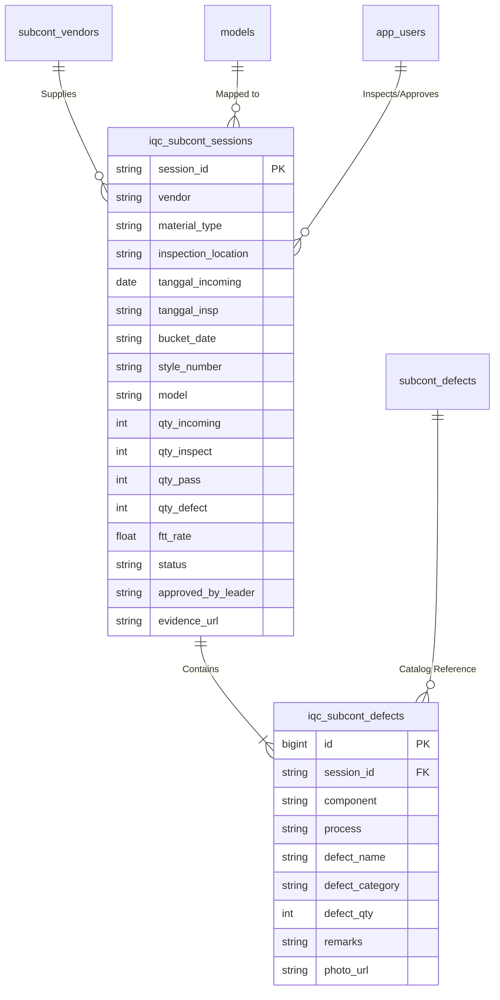
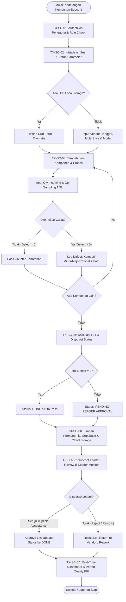
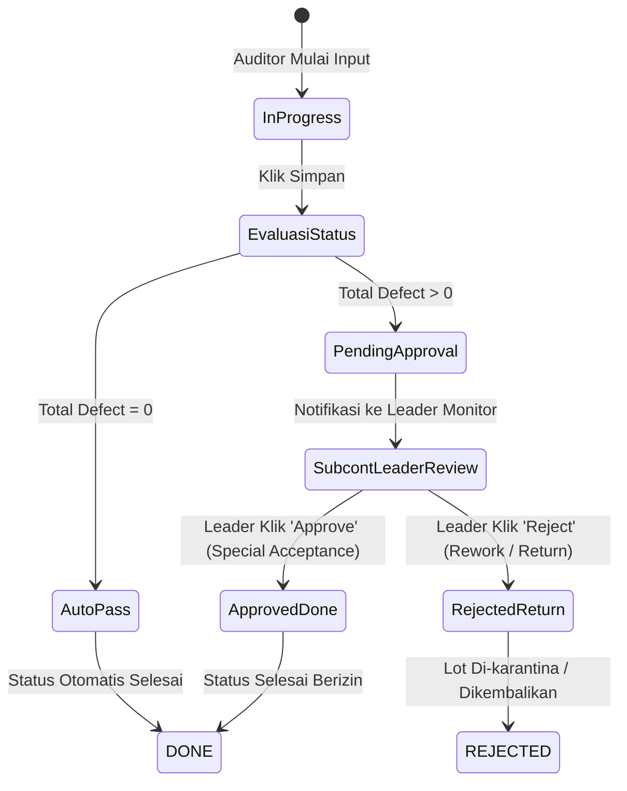

# END-TO-END BUSINESS PROCESS: IQC SUBCONT (SUBCONTRACTOR QUALITY CONTROL)
**Document Version:** 2.0  
**Target Platform:** eQMS Incoming Quality Control (Subcont Division)  
**Output Purpose:** Blueprint Operasional & Struktur Prompt Presentasi (Slide-by-Slide PPT Generation)

---

## SLIDE 1: Executive Summary & Tujuan Sistem IQC Subcont
### 1. Definisi & Latar Belakang
- **IQC Subcont (Incoming Quality Control Subcontractor):** Sistem kendali mutu terpadu untuk memeriksa dan memvalidasi komponen sepatu (Upper & Bottom) yang diproduksi oleh mitra subkontraktor luar (*vendor/subcont*) sebelum dikirim ke lini *Assembly/Stitching*.
- **Problem Statement:**
  - Riwayat inspeksi berbasis kertas rawan tercecer, lambat direkap, dan rentan manipulasi.
  - Sesi inspeksi multi-hari sering kali menduplikasi hitungan *Qty Incoming* yang menyebabkan distorsi kalkulasi reject rate.
  - Risiko kehilangan data (*data loss*) jika browser tertutup saat inspeksi di lantai pabrik (*shopfloor*).
  - Kurangnya *real-time visibility* status lot bermasalah (*Pending Approval*) bagi pimpinan/Leader QC.
- **Tujuan Utama (Goals):**
  - Standardisasi inspeksi berbasis AQL (*Acceptable Quality Limit*) dan grading defect (*Minor, Major, Critical*).
  - Peningkatan metrik FTT (*First Time Through*) dan transparansi mutu vendor.
  - Otomasi alur persetujuan lot cacat (*Auto-Pass vs Leader Approval*).
  - 100% *digital traceability* terintegrasi dengan bukti foto cloud storage.

---

## SLIDE 2: Matriks Aktor, Peran & Tanggung Jawab (RACI Matrix)
| Peran / Aktor | Tanggung Jawab Utama | Akses Sistem |
| :--- | :--- | :--- |
| **QC Auditor / Inspector** | Eksekusi fisik sampling, input sesi inspeksi, pencatatan cacat (*defect logging*), lampirkan bukti foto, simpan draf. | Form Inspeksi, Riwayat Sesi Pribadi. |
| **QC Subcont Leader** | Supervisi teknis, review lot cacat/kritis, eksekusi disposisi lot (*Approve Lot Defect* / *Reject Return*). | Form Inspeksi, Leader Monitor Panel. |
| **QC Supervisor & Manager** | Monitoring FTT, analisis tren defect bulanan, evaluasi vendor scorecard, kebijakan mutu. | Dashboard Analytics, Inspection Result Gallery, Audit Log. |
| **QC System Administrator** | Tata kelola master data (Katalog Defect, Vendor, Akun Pengguna, Model & Style), audit trail. | Admin Panel, User Management, Database Sync. |

---

## SLIDE 3: Arsitektur Data & Entitas Transaksi
### Struktur Data Inti

---

## SLIDE 4: Diagram Alur Proses Bisnis End-to-End (Global Flowchart)

---

## SLIDE 5: Transaksi 1 — Autentikasi & Otorisasi Pengguna (TX-SC-01)
### 1. Deskripsi Transaksi
Mekanisme pengamanan sistem untuk memastikan setiap aktivitas inspeksi dan persetujuan memiliki akuntabilitas (*non-repudiation*) berbasis NIK (*Nomor Induk Karyawan*).
### 2. Parameter Input
- NIK Pengguna & Kata Sandi.
### 3. Logika & Aturan Bisnis (RBAC)
- **Role Auditor:** Hanya dapat membuat draf, mengedit draf milik sendiri, dan submit sesi inspeksi baru.
- **Role Leader:** Berwenang melakukan review dan disposisi *Approve* pada lot berstatus *Pending Leader Approval*.
- **Role Supervisor/Manager:** Akses analitik, monitor KPI, dan ekspor laporan tanpa hak submit harian.
- **Role Admin:** Hak penuh mengelola master data defect, akun pengguna, dan audit sesi.
### 4. Output & Dampak
- JWT Session tersimpan aman di `sessionStorage` / cookie terenkripsi.
- Hak akses menu navigasi dirender sesuai peran aktif.

---

## SLIDE 6: Transaksi 2 — Inisialisasi Sesi Inspeksi & Auto-Save Draf (TX-SC-02)
### 1. Deskripsi Transaksi
Penetapan parameter sesi inspeksi sebelum pemeriksaan fisik dimulai, didukung proteksi draf offline/lokal anti-kehilangan data.
### 2. Langkah Proses Operasional
1. **Pemilihan Kategori Material:** Memilih `Upper` atau `Bottom`.
2. **Pemilihan Vendor Subcont:** Memilih dari daftar aktif vendor mitra terverifikasi.
3. **Penetapan Lokasi Inspeksi:**
   - *In-House Inspection:* Komponen diperiksa di area receiving pabrik utama.
   - *In-Vendor Inspection:* Inspeksi dilakukan langsung di lokasi pabrik subkontraktor.
4. **Input Multi-Tanggal:**
   - *Tanggal Incoming:* Tanggal fisik komponen masuk area receiving.
   - *Tanggal Inspeksi (Multi-Date Tags):* Mendukung pencatatan tanggal inspeksi bertahap (bisa lebih dari 1 hari).
   - *Bucket Date (Multi-Date Tags):* Tanggal rencana produksi (*production bucket schedule*).
5. **Multi-Style Number & Auto-Detect Model:**
   - Auditor mengetik Style Number (contoh: `CW2288-111`).
   - Sistem melakukan *instant lookup* ke Master Model Database dan menampilkan nama model otomatis (contoh: `AIR FORCE 1 '07`).
   - Auditor dapat menambahkan lebih dari satu Style Number dalam satu lot kedatangan yang sama.
6. **Mekanisme Auto-Save Draf (`localStorage`):**
   - Setiap ketikan atau perubahan tag otomatis tersimpan ke `localStorage` dengan kunci unik `qms_subcont_draft_{userNIK}`.
   - Jika tab browser tertutup atau baterai mati, saat dibuka kembali muncul banner:
     *"DRAF TERSIMPAN DIPULIHKAN"* dengan ringkasan data dan opsi *Buang Draf*.

---

## SLIDE 7: Transaksi 3 — Eksekusi Sampling & Pencatatan Defect (TX-SC-03)
### 1. Deskripsi Transaksi
Pencatatan detail hasil uji sampling fisik per item komponen dan proses produksi.
### 2. Aturan Sampling (AQL Standard)
- Penentuan jumlah sampel periksa (*Qty Inspect*) mengacu pada tabel *AQL 2.5 Normal Inspection Level II* berdasarkan rentang *Qty Incoming*.
### 3. Alur Input Detail Item (Modal Component)
- **Komponen & Proses:** Pemilihan nama komponen (misal: *Vamp, Eyestay, Tongue*) dan proses (misal: *Cutting, Screen Print, Emboss*).
- **Penghitungan Pass/Defect:**
  - Tombol aksi cepat *Pass (+1)* dan *Defect (+1)*.
  - Input kuantitas manual untuk pemeriksaan skala besar.
- **Katalog Defect Bertingkat:**
  - **Minor Defect:** Cacat estetika ringan di area non-kritis (toleransi terbatas).
  - **Major Defect:** Cacat fungsional/penampilan yang berpotensi menurunkan nilai jual produk.
  - **Critical Defect:** Cacat fatal keselamatan atau ketidaksesuaian spesifikasi total (toleransi = 0).
- **Pencatatan Bukti Foto (*Evidence Photo*):**
  - Kamera langsung atau upload berkas foto cacat untuk verifikasi teknis.

---

## SLIDE 8: Transaksi 4 — Evaluasi Kelolosan & Disposisi Status (TX-SC-04)
### 1. Logika Kalkulasi Kualitas
- **Pass Rate (%):** `(Qty Pass / Qty Inspect) * 100`
- **Defect Rate (%):** `(Qty Defect / Qty Inspect) * 100`
- **First Time Through (FTT):** Persentase lot yang lolos tanpa cacat pada pemeriksaan pertama.
### 2. Aturan Disposisi Status Otomatis

---

## SLIDE 9: Transaksi 5 — Akumulasi Inspeksi Bertahap / Multi-Day (TX-SC-05)
### 1. Latar Belakang Masalah
Pada lot besar (misal: 10.000 pasang), inspeksi membutuhkan waktu 2–3 hari. Jika inspector membuat sesi baru tiap hari, *Qty Incoming* akan terhitung 3x (30.000 pasang) sehingga laporan inventori dan reject rate menjadi salah total.
### 2. Solusi Bisnis: Mode *Continue In-Progress Session*
- **Satu Sesi, Multi-Tanggal:** Auditor membuka kembali sesi berstatus *In-Progress* dari Gallery.
- **Aggregated Qty Logic:**
  - *Qty Incoming* diambil nilai maksimum lot (tidak dijumlahkan ganda).
  - *Qty Inspect*, *Pass*, dan *Defect* diakumulasikan secara bertahap.
  - Tanggal inspeksi baru otomatis ditambahkan ke daftar *Inspection Date Tags*.
- **Hasil:** Data mutasi akurat, integritas kalkulasi AQL terjaga 100%.

---

## SLIDE 10: Transaksi 6 — Persetujuan Leader & Tata Kelola Lot Cacat (TX-SC-06)
### 1. Peran Subcont Leader Monitor
Pusat kendali bagi Leader QC untuk memantau semua sesi yang tertahan karena memiliki temuan cacat (*Defect > 0*).
### 2. Prosedur Persetujuan (Disposisi Lot)
1. **Penyaringan Antrean:** Leader membuka tab *Leader Monitoring Panel* (indikator kartu berkedip kuning).
2. **Review Temuan:** Leader memeriksa nama vendor, komponen bermasalah, jumlah defect, dan membuka foto bukti kerusakan.
3. **Analisis Risiko Teknis:** Menilai apakah defect dapat diperbaiki (*reworkable*), dapat diterima toleransi (*concession / special acceptance*), atau harus ditolak mentah-mentah (*scrap / return to vendor*).
4. **Eksekusi Approval:**
   - Klik tombol **Approve**: Kolom `approved_by_leader` terisi NIK/Nama Leader, dan status sesi beralih menjadi `Approved` / `Done`.
   - Log approval tercatat permanen di cloud untuk keperluan audit ISO/QMS.

---

## SLIDE 11: Transaksi 7 — Sinkronisasi Cloud & Penyimpanan Data (TX-SC-07)
### 1. Arsitektur Sinkronisasi Dual-Layer
- **Primary Database (Supabase PostgreSQL):**
  - Tabel `iqc_subcont_sessions` untuk header transaksi.
  - Tabel `iqc_subcont_defects` untuk detail cacat.
  - Supabase Storage bucket `evidence` untuk menyimpan berkas foto resolusi tinggi.
- **Secondary / Legacy Backup (Google Apps Script & Google Sheets):**
  - Otomatis mencadangkan baris inspeksi ke Spreadsheet korporat untuk integrasi pelaporan manajemen tingkat atas.
### 2. Siklus Pembersihan Draf
- Segera setelah `saveData()` mengembalikan status sukses (HTTP 200/201), sistem menghapus draf di `localStorage` dan mereset form ke kondisi awal hari ini.

---

## SLIDE 12: Transaksi 8 — Analisis Mutu, Pareto Defect & Vendor Scorecard (TX-SC-08)
### 1. Metrik Utama Dashboard QC
- **Top Metrics Row:**
  - *Total Qty Incoming* & *Total Qty Inspect*.
  - *Average Pass Rate (%)* & *FTT Rate (%)*.
  - *Total Defect Volume*.
- **Defect Pareto Chart:** Mengidentifikasi 20% jenis cacat yang menyumbang 80% masalah (*The Vital Few*).
- **Vendor Scorecard:**
  - Pemeringkatan vendor subkontraktor berdasarkan kepatuhan mutu (Grade A, B, C).
  - Peringatan dini (*early warning*) untuk vendor dengan reject rate melampaui ambang batas 2.5%.
- **Inspection Result Gallery:** Kartu digital interaktif per sesi lengkap dengan status badge, ringkasan komponen, dan tombol *Lanjutkan Sesi*.

---

## SLIDE 13: Transaksi 9 — Tata Kelola Master Data & Audit Trail (TX-SC-09)
### 1. Fitur Panel Admin
- **Defect Catalog Management:** Tambah, edit, non-aktifkan kode defect beserta kategori keparahan (*Minor, Major, Critical*).
- **User & Access Governance:** Pengaturan hak akses NIK, penetapan peran (*Inspector, Leader, Supervisor, Admin*), dan status otorisasi login.
- **Vendor Master Management:** Pemeliharaan direktori vendor rekanan aktif dan klasifikasi jenis materialnya (*Upper/Bottom*).
- **Audit Log & Session Maintenance:** Pelacakan rekam jejak pengeditan dan pemulihan sesi jika terjadi kesalahan input manual.

---

## SLIDE 14: Ringkasan Nilai Bisnis (Business Values & ROI)
1. **Zero Data Loss:** Perlindungan berlapis draf lokal memastikan pekerjaan auditor di lapangan aman dari kendala sinyal atau gangguan perangkat.
2. **Eliminasi Double-Counting:** Perhitungan volume incoming multi-hari akurat menjamin keadilan penilaian performa vendor.
3. **Penyelesaian Cepat (Cycle Time):** Sesi tanpa defect langsung lolos instan (*Auto-Pass*), sementara lot bermasalah terlokalisasi dalam satu antrean Leader Monitor.
4. **Audit Readiness 100%:** Bukti foto digital dan jejak persetujuan bertingkat memenuhi standar sertifikasi industri alas kaki global.
